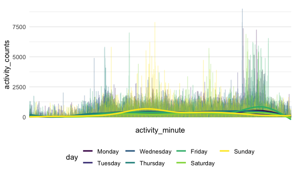
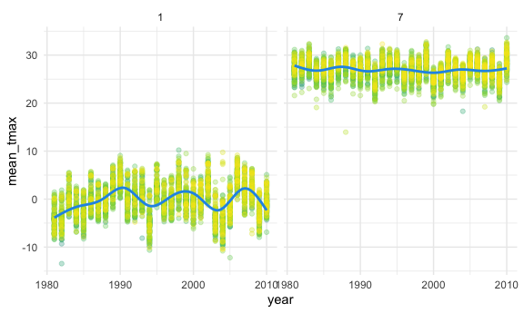
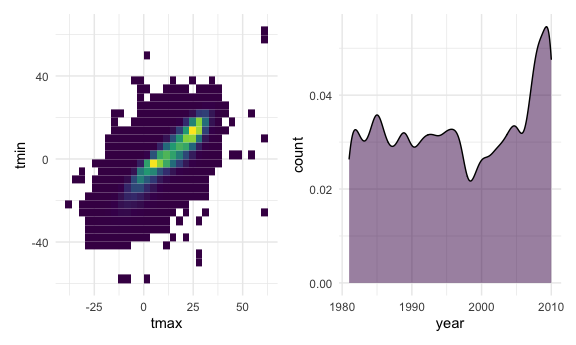

Homework 3
================
Hanyu Lu
2020-10-10

### Due date

Due: October 10 at 10:00pm.

### Points

| Problem         | Points    |
| :-------------- | :-------- |
| Problem 0       | 20        |
| Problem 1       | –         |
| Problem 2       | 40        |
| Problem 3       | 40        |
| Optional survey | No points |

### Problem 0

This “problem” focuses on structure of your submission, especially the
use git and GitHub for reproducibility, R Projects to organize your
work, R Markdown to write reproducible reports, relative paths to load
data from local files, and reasonable naming structures for your files.

### Problem 1

``` r
data("instacart")
```

This dataset contains 1384617 rows and … columns.

Observations are the level of items in orders by user. There are user /
order variables – user ID, order ID, order day, and order hour. There
are also item variables – name, aisle, department, and some numeric
codes.

How many aisles, and which are most items from?

``` r
instacart %>% 
    count(aisle) %>% 
    arrange(desc(n))
```

    ## # A tibble: 134 x 2
    ##    aisle                              n
    ##    <chr>                          <int>
    ##  1 fresh vegetables              150609
    ##  2 fresh fruits                  150473
    ##  3 packaged vegetables fruits     78493
    ##  4 yogurt                         55240
    ##  5 packaged cheese                41699
    ##  6 water seltzer sparkling water  36617
    ##  7 milk                           32644
    ##  8 chips pretzels                 31269
    ##  9 soy lactosefree                26240
    ## 10 bread                          23635
    ## # … with 124 more rows

Let’s make a plot

``` r
instacart %>% 
    count(aisle) %>% 
    filter(n > 10000) %>% 
    mutate(
        aisle = factor(aisle),
        aisle = fct_reorder(aisle, n)
    ) %>% 
    ggplot(aes(x = aisle, y = n)) + 
    geom_point() + 
    theme(axis.text.x = element_text(angle = 90, vjust = 0.5, hjust = 1))
```


Let’s make a table\!\!

``` r
instacart %>% 
    filter(aisle %in% c("baking ingredients", "dog food care", "packaged vegetables fruits")) %>% 
    group_by(aisle) %>% 
    count(product_name) %>% 
    mutate(rank = min_rank(desc(n))) %>% 
    filter(rank < 4) %>% 
    arrange(aisle, rank) %>% 
    knitr::kable()
```

| aisle                      | product\_name                                 |    n | rank |
| :------------------------- | :-------------------------------------------- | ---: | ---: |
| baking ingredients         | Light Brown Sugar                             |  499 |    1 |
| baking ingredients         | Pure Baking Soda                              |  387 |    2 |
| baking ingredients         | Cane Sugar                                    |  336 |    3 |
| dog food care              | Snack Sticks Chicken & Rice Recipe Dog Treats |   30 |    1 |
| dog food care              | Organix Chicken & Brown Rice Recipe           |   28 |    2 |
| dog food care              | Small Dog Biscuits                            |   26 |    3 |
| packaged vegetables fruits | Organic Baby Spinach                          | 9784 |    1 |
| packaged vegetables fruits | Organic Raspberries                           | 5546 |    2 |
| packaged vegetables fruits | Organic Blueberries                           | 4966 |    3 |

Apples vs ice cream..

``` r
instacart %>% 
    filter(product_name %in% c("Pink Lady Apples", "Coffee Ice Cream")) %>% 
    group_by(product_name, order_dow) %>% 
    summarize(mean_hour = mean(order_hour_of_day)) %>% 
    pivot_wider(
        names_from = order_dow,
        values_from = mean_hour
    )
```

    ## `summarise()` regrouping output by 'product_name' (override with `.groups` argument)

    ## # A tibble: 2 x 8
    ## # Groups:   product_name [2]
    ##   product_name       `0`   `1`   `2`   `3`   `4`   `5`   `6`
    ##   <chr>            <dbl> <dbl> <dbl> <dbl> <dbl> <dbl> <dbl>
    ## 1 Coffee Ice Cream  13.8  14.3  15.4  15.3  15.2  12.3  13.8
    ## 2 Pink Lady Apples  13.4  11.4  11.7  14.2  11.6  12.8  11.9

# Problem 2

``` r
accel_df =
  read_csv("./accel_data.csv") %>% 
  janitor::clean_names() %>% 
  pivot_longer(
    activity_1:activity_1440,
    names_to = "activity_minute_o",
    values_to = "activity_counts"
  ) %>% 
  separate(activity_minute_o, into = c("activity", "activity_minute"), sep = 9) %>% 
  mutate(
    day = factor(day),
    day = ordered(day, levels = c("Monday", "Tuesday", "Wednesday", "Thursday", 
"Friday", "Saturday", "Sunday")),
    activity_minute = as.double(activity_minute),
    weekday_vs_weekend = case_when(
      day == "Monday" ~ "Weekday",
      day == "Tuesday" ~ "Weekday",
      day == "Wednesday" ~ "Weekday",
      day == "Thursday" ~ "Weekday",
      day == "Friday" ~ "Weekday",
      day == "Saturday" ~ "Weekend",
      day == "Sunday" ~ "Weekend",
    )
  )
```

    ## Parsed with column specification:
    ## cols(
    ##   .default = col_double(),
    ##   day = col_character()
    ## )

    ## See spec(...) for full column specifications.

There are 6 variables in this dataset, including week, day\_id, day,
activity, activity\_minute, activity\_counts, weekday\_vs\_weekend.
There are a total of 50400 observations.

``` r
accel_df %>% 
  group_by(week, day) %>% 
  summarize(
    mean_day = mean(activity_counts),
  ) %>% 
  arrange(day) %>% 
  knitr::kable(digits = 1)
```

    ## `summarise()` regrouping output by 'week' (override with `.groups` argument)

| week | day       | mean\_day |
| ---: | :-------- | --------: |
|    1 | Monday    |      54.7 |
|    2 | Monday    |     205.2 |
|    3 | Monday    |     476.3 |
|    4 | Monday    |     284.3 |
|    5 | Monday    |     270.2 |
|    1 | Tuesday   |     213.3 |
|    2 | Tuesday   |     293.9 |
|    3 | Tuesday   |     264.9 |
|    4 | Tuesday   |     221.9 |
|    5 | Tuesday   |     255.4 |
|    1 | Wednesday |     236.2 |
|    2 | Wednesday |     306.2 |
|    3 | Wednesday |     325.6 |
|    4 | Wednesday |     301.7 |
|    5 | Wednesday |     309.3 |
|    1 | Thursday  |     247.2 |
|    2 | Thursday  |     329.2 |
|    3 | Thursday  |     257.8 |
|    4 | Thursday  |     236.3 |
|    5 | Thursday  |     381.7 |
|    1 | Friday    |     333.7 |
|    2 | Friday    |     395.0 |
|    3 | Friday    |     324.6 |
|    4 | Friday    |     107.0 |
|    5 | Friday    |     431.2 |
|    1 | Saturday  |     261.3 |
|    2 | Saturday  |     421.6 |
|    3 | Saturday  |     265.9 |
|    4 | Saturday  |       1.0 |
|    5 | Saturday  |       1.0 |
|    1 | Sunday    |     438.3 |
|    2 | Sunday    |     293.1 |
|    3 | Sunday    |     324.3 |
|    4 | Sunday    |     181.0 |
|    5 | Sunday    |      96.1 |

Tuesday and Wednesday have relatively stable activity counts, while
Saturday and Sunday experience a decrease in activity counts.

``` r
accel_df %>% 
  group_by(week, day) %>% 
  arrange(activity_minute) %>% 
  ggplot(aes(x = activity_minute, y = activity_counts, color = day)) + 
    geom_line(alpha = 0.3) +
    geom_smooth(se = FALSE) +
  scale_x_discrete(
    breaks = c(0, 720, 1440), 
    labels = c(0, 12, 24))
```

    ## `geom_smooth()` using method = 'gam' and formula 'y ~ s(x, bs = "cs")'



In general, this patient has a decreasing trend in total activities.
This patiennt tends to do more activities at noon in Sunday, and at
night in weekdays.

# Problem 3

There are 2595176 rows and 7 columns in this dataset. This dataset
contains id, date, prcp, snow, snwd, tmax, tmin. This dataset contains
five core variables for all New York state weather stations from January
1, 1981 through December 31, 2010. Each weather station may collect only
a subset of these variables, and therefore the resulting dataset
contains extensive missing data. Missing data can result in a lot of NAs
in the dataset, which makes it hard to manipulate data.

``` r
library(p8105.datasets)
data("ny_noaa")
```

``` r
ny_noaa %>% 
  mutate(
    year = lubridate::year(date), 
    month = lubridate::month(date), 
    day = lubridate::day(date),
    tmax = as.numeric(tmax),
    tmax = tmax/10,
    tmin = as.numeric(tmin),
    tmin = tmin/10
  ) %>% 
  select(-date)
```

    ## # A tibble: 2,595,176 x 9
    ##    id           prcp  snow  snwd  tmax  tmin  year month   day
    ##    <chr>       <int> <int> <int> <dbl> <dbl> <dbl> <dbl> <int>
    ##  1 US1NYAB0001    NA    NA    NA    NA    NA  2007    11     1
    ##  2 US1NYAB0001    NA    NA    NA    NA    NA  2007    11     2
    ##  3 US1NYAB0001    NA    NA    NA    NA    NA  2007    11     3
    ##  4 US1NYAB0001    NA    NA    NA    NA    NA  2007    11     4
    ##  5 US1NYAB0001    NA    NA    NA    NA    NA  2007    11     5
    ##  6 US1NYAB0001    NA    NA    NA    NA    NA  2007    11     6
    ##  7 US1NYAB0001    NA    NA    NA    NA    NA  2007    11     7
    ##  8 US1NYAB0001    NA    NA    NA    NA    NA  2007    11     8
    ##  9 US1NYAB0001    NA    NA    NA    NA    NA  2007    11     9
    ## 10 US1NYAB0001    NA    NA    NA    NA    NA  2007    11    10
    ## # … with 2,595,166 more rows

``` r
ny_noaa %>% 
    count(snow) %>% 
    arrange(desc(n))
```

    ## # A tibble: 282 x 2
    ##     snow       n
    ##    <int>   <int>
    ##  1     0 2008508
    ##  2    NA  381221
    ##  3    25   31022
    ##  4    13   23095
    ##  5    51   18274
    ##  6    76   10173
    ##  7     8    9962
    ##  8     5    9748
    ##  9    38    9197
    ## 10     3    8790
    ## # … with 272 more rows

I convert tenths of Celcius degree to Celcius degree to make it easier
to understand. The most commonly observed value for snowfall is 0
because New York has a higher probability of not snowing all over the
year.

``` r
ny_noaa %>% 
  mutate(
    year = lubridate::year(date), 
    month = lubridate::month(date), 
    day = lubridate::day(date),
    tmax = as.numeric(tmax),
    tmax = tmax/10,
    tmin = as.numeric(tmin),
    tmin = tmin/10
  ) %>% 
  select(-date) %>% 
    filter(month == 7 | month == 1) %>% 
    group_by(id, month, year) %>% 
  summarize (
    mean_tmax = mean(tmax, na.rm=TRUE)
  ) %>% 
  ggplot(aes(x = year, y = mean_tmax, color = id)) + 
  geom_point(alpha = 0.3) +
  geom_smooth(se = FALSE, color = 100) +
  facet_grid(. ~ month) +
  theme(legend.position = "none")
```

    ## `summarise()` regrouping output by 'id', 'month' (override with `.groups` argument)

    ## `geom_smooth()` using method = 'gam' and formula 'y ~ s(x, bs = "cs")'

    ## Warning: Removed 5970 rows containing non-finite values (stat_smooth).

    ## Warning: Removed 5970 rows containing missing values (geom_point).



The temperature of January is around 0 degrees C with fluctuations,
while temperature of July is around 25 degrees C with smoother line. For
outliers, here are extremely cold Januarys in 1982 and 2005, and an
unusually cool July in 1988.

``` r
library(patchwork)
library(ggridges)

tmax_tmin = 
ny_noaa %>% 
  mutate(
    year = lubridate::year(date), 
    month = lubridate::month(date), 
    day = lubridate::day(date),
    tmax = as.numeric(tmax),
    tmax = tmax/10,
    tmin = as.numeric(tmin),
    tmin = tmin/10
  ) %>% 
  drop_na(tmax,tmin) %>% 
  select(-date) %>% 
  ggplot(aes(x = tmax, y = tmin)) +
  geom_bin2d() +
  theme(legend.position = "none")

snow_dist =
  ny_noaa %>% 
  mutate(
    year = lubridate::year(date), 
    month = lubridate::month(date), 
    day = lubridate::day(date),
    tmax = as.numeric(tmax),
    tmax = tmax/10,
    tmin = as.numeric(tmin),
    tmin = tmin/10
  ) %>% 
  select(-date) %>% 
  filter(snow > 0 & snow <100) %>% 
  ggplot(aes(x = year, fill = "red")) + 
  geom_density(alpha = .5) +
  theme(legend.position = "none") +
  ylab("count")

tmax_tmin + snow_dist
```


